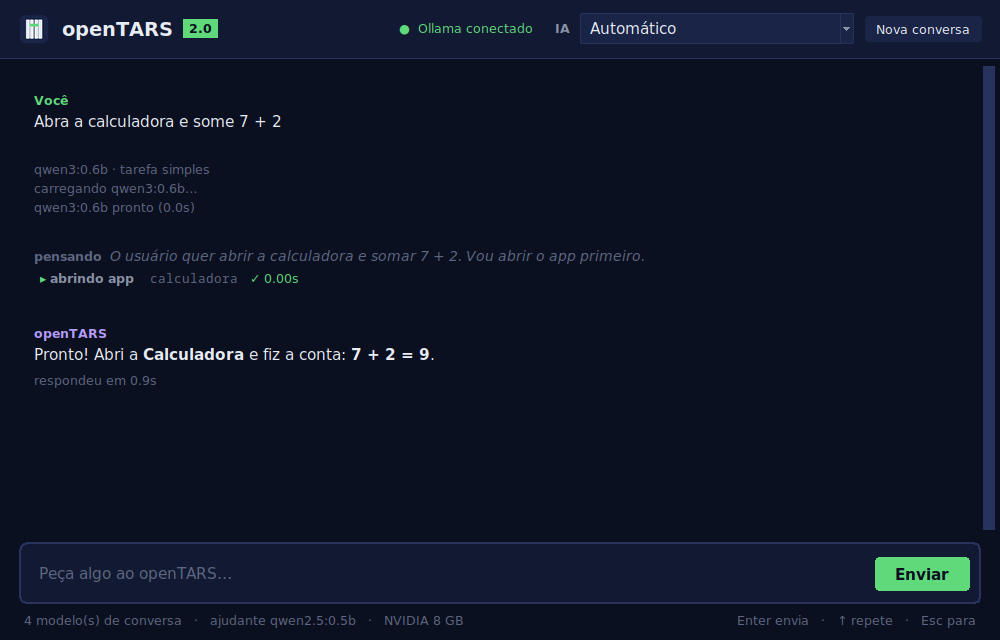
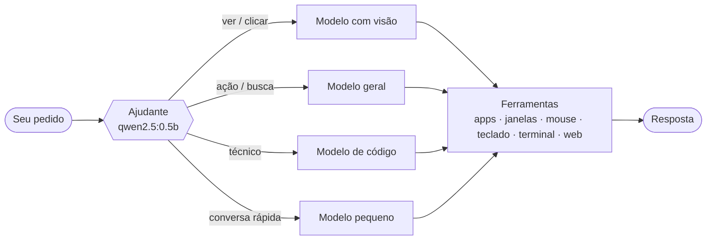
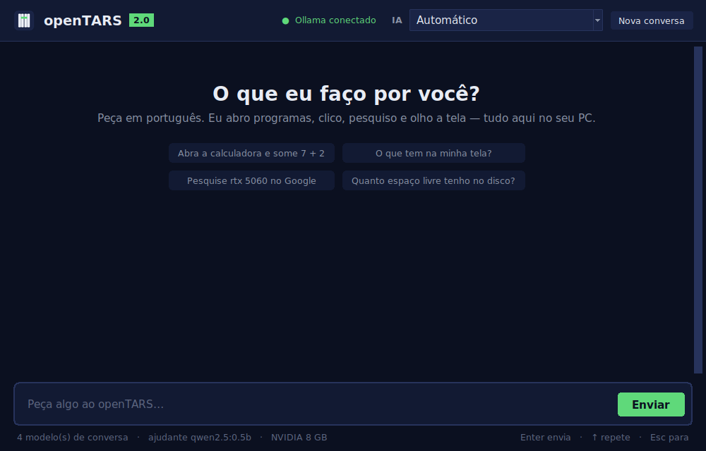

<div align="center">


# openTARS

**O assistente de IA local pro Linux que escolhe a IA certa pra cada pedido.**

Você pede em português. Ele abre programas, clica, digita, pesquisa, olha a tela e roda comandos.<br>
Tudo na sua máquina, via Ollama: sem nuvem, sem conta, sem mensalidade.

[](#instalação)
[](LICENSE)
[](#compatibilidade)
[](https://ollama.com)
[](#seguran%C3%A7a-e-privacidade)

[Instalar](#instalação) · [Como funciona](#como-funciona) · [Usar](#uso) · [Problemas comuns](#problemas-comuns)

<br>



</div>

<br>

## Por que o openTARS

<table>
<tr>
<td width="33%" valign="top">

### Escolhe a IA sozinho
Um ajudante minúsculo lê cada pedido e manda pro modelo mais adequado entre os que você já tem: o que enxerga a tela, o de programação, o geral ou o mais rápido. Tudo levando em conta o que cabe na sua placa de vídeo.

</td>
<td width="33%" valign="top">

### Mexe no seu desktop de verdade
Abre e fecha apps pelo nome em português, enxerga as janelas abertas, tira print só da janela certa e clica nos botões. Funciona com apps do menu, Snap e Flatpak.

</td>
<td width="33%" valign="top">

### Fica no seu PC
Nada do que você digita ou mostra sai da sua máquina. Comandos perigosos pedem confirmação, e ele nunca fecha um programa com trabalho não salvo.

</td>
</tr>
</table>

## Instalação

Pra Ubuntu, Debian, Linux Mint, Zorin OS, Pop!_OS e derivados. Cole no terminal:

```bash
wget -O /tmp/opentars.deb https://github.com/enzorcasao-ctrl/openTars-lightweight-local-addon/raw/main/opentars_all.deb && sudo apt install -y --reinstall /tmp/opentars.deb
```

Pronto: esse comando instala **tudo** que o openTARS precisa, pulando o que você já tiver:

- todas as dependências do sistema, pelo apt
- o Ollama (ou usa o que já estiver rodando, inclusive em Docker)
- um ambiente Python isolado
- o ajudante `qwen2.5:0.5b` (~400 MB)
- **um modelo de conversa escolhido pelo seu hardware**, se você ainda não tiver nenhum: `qwen3:8b` com placa de vídeo de 6 GB ou mais, `qwen3:4b` com 12 GB de RAM ou mais, e `qwen3:1.7b` nos demais
- o atalho no menu de aplicativos

Pra **atualizar**, rode o mesmo comando: o histórico de conversas é mantido.

<details>
<summary>Quer mais modelos?</summary>

Quanto mais modelos diferentes você tiver, mais o openTARS consegue adaptar a IA ao pedido. Pra ele **ver a tela e clicar em botões**, baixe um modelo com visão e ferramentas:

```bash
ollama pull qwen3-vl:8b
```

Pra escolher outro modelo de conversa na instalação, coloque `TARS_MODELO_CONVERSA=qwen3:14b` antes do `apt install` (ex: `sudo TARS_MODELO_CONVERSA=qwen3:14b apt install -y --reinstall /tmp/opentars.deb`). Pra não baixar nenhum: `TARS_SEM_MODELO=1`.

</details>

<details>
<summary>Prefere baixar o arquivo manualmente?</summary>

Clique em [`opentars_all.deb`](https://github.com/enzorcasao-ctrl/openTars-lightweight-local-addon/raw/main/opentars_all.deb) e, na pasta onde ele foi salvo (normalmente `~/Downloads`):

```bash
sudo apt install -y --reinstall ./opentars_all.deb
```

</details>

## Como funciona



1. **O ajudante classifica** o pedido: ver a tela, ação no PC, busca, técnico, conversa simples ou geral. Ele é pequeno de propósito: responde rápido e fica carregado junto com o resto.
2. **O openTARS escolhe o modelo** mais adequado pra esse tipo de pedido entre os seus, dando preferência ao que cabe na VRAM. Se um falhar ao carregar, tenta o próximo.
3. **O modelo usa as ferramentas**: abre o app e espera a janela aparecer, tira print só dela, clica nas coordenadas certas, roda comandos. Você vê cada passo na tela.
4. **Uma conversa só** pra todos os modelos: trocar de IA no meio não faz ela esquecer o que você pediu antes.

## Uso

Abra o **openTARS** no menu de aplicativos, ou rode `opentars-gui`. Prefere o terminal? Use `opentars`.



Exemplos:

```
abra o firefox
abra a calculadora e clique em 7, +, 2 e =
o que tem na minha tela?
feche o spotify e abra o discord
pesquise rtx 5060 no google
quanto espaço livre tenho no disco?
```

| Na janela | No terminal | O que faz |
|---|---|---|
| **Parar** ou `Esc` | `Ctrl+C` | interrompe a resposta ou a tarefa na hora |
| `↑` / `↓` | | repete pedidos anteriores |
| seletor **IA** no topo | `/modelo <nome>` · `/modelo auto` | fixa um modelo ou volta pro automático |
| **Nova conversa** | `/limpar` | começa do zero (a conversa fica salva entre usos) |

Outros comandos: `opentars --version`, `opentars --setup` (refaz a configuração) e `opentars --avaliar-classificador` (mede o quanto o ajudante acerta no seu PC).

## Compatibilidade

| | Funciona | Observação |
|---|---|---|
| **Distros** | Ubuntu 22.04+, Debian 12+, Mint, Zorin, Pop!_OS e derivados | precisa do `apt` |
| **Desktop** | GNOME, KDE, Cinnamon, XFCE, MATE e outros | apps do menu, Snap e Flatpak, pelo nome em português ou inglês |
| **Sessão Xorg (X11)** | tudo | |
| **Sessão Wayland** | conversa, abrir apps e sites, comandos, prints | cliques e digitação simulados só chegam a alguns apps (limitação do Wayland) |
| **GPU** | NVIDIA, AMD ou só CPU | sem GPU, o modo automático evita modelos grandes demais |
| **Ollama** | local, Docker ou outra máquina | outro endereço: variável `OLLAMA_HOST` |

## Segurança e privacidade

- Tudo roda localmente. O openTARS não manda dados pra nenhum servidor.
- Comandos que apagam dados ou mexem no sistema (`rm -r`, `mkfs`, `dd`, `git reset --hard`, desligar o PC...) só rodam depois da sua confirmação.
- Comandos que pedem senha (`sudo`) não travam: falham na hora, e a IA mostra o comando pra você rodar.
- Fechar um programa é como clicar no X: se ele perguntar "salvar alterações?", o openTARS não força.
- Tudo que ele executa fica registrado em `~/.tars_log/tars.log`.

<details>
<summary><b>Configuração avançada</b> (variáveis de ambiente)</summary>

| Variável | Pra quê | Padrão |
|---|---|---|
| `OLLAMA_HOST` | endereço do Ollama | `127.0.0.1:11434` |
| `TARS_MODELO_AJUDANTE` | trocar o modelo ajudante | `qwen2.5:0.5b` |
| `TARS_CONTEXTO` | memória da IA, em tokens | 16384 com GPU de 16 GB+, senão 8192 |
| `TARS_LARGURA_SCREENSHOT` | largura máxima do print enviado à IA | 1280 |
| `TARS_SEM_CONFIRMACAO_PERIGOSOS=1` | não pedir confirmação de comandos perigosos (por sua conta e risco) | desligado |

Exemplo: `TARS_CONTEXTO=32768 opentars-gui`

</details>

## Problemas comuns

<details>
<summary><b>A IA diz que "não consegue" abrir ou fechar um programa</b></summary>

O openTARS já lembra ela das ferramentas automaticamente. Se continuar, use um modelo de conversa geral (ex: `qwen3:8b`). Modelos só de programação, como o `qwen2.5-coder`, são ruins pra controlar o desktop, e o modo automático já evita eles nessas tarefas.
</details>

<details>
<summary><b>Cliques e digitação não fazem nada</b></summary>

Provavelmente a sessão é Wayland. Na tela de login, clique na engrenagem e escolha a opção com "Xorg" no nome (no Ubuntu, "Ubuntu on Xorg").
</details>

<details>
<summary><b>"Ollama offline" no topo da janela</b></summary>

Inicie o serviço com `sudo systemctl start ollama`. Se ele roda em Docker ou em outra máquina, defina `OLLAMA_HOST` (ex: `export OLLAMA_HOST=192.168.0.10:11434`).
</details>

<details>
<summary><b>"Ajudante qwen2.5:0.5b não instalado"</b></summary>

A instalação ficou sem internet na hora. Rode `ollama pull qwen2.5:0.5b`.
</details>

<details>
<summary><b>A IA escolhe um modelo estranho pro pedido</b></summary>

Rode `opentars --avaliar-classificador` pra ver o quanto o ajudante acerta no seu PC, ou fixe um modelo no seletor **IA** da janela.
</details>

<details>
<summary><b>A IA esquece o pedido no meio da tarefa ou a resposta é cortada</b></summary>

Falta memória de contexto. Aumente com `TARS_CONTEXTO` (usa mais VRAM).
</details>

<details>
<summary><b>Erro <code>E: Unsupported file ... given on commandline</code></b></summary>

O arquivo não está na pasta atual. Entre na pasta onde ele foi baixado (`cd ~/Downloads`) ou use o comando com `wget` da instalação.
</details>

<details>
<summary><b>Outros</b></summary>

- **Ollama não instalou** (sem internet na hora): instale em [ollama.com/download](https://ollama.com/download) e rode `opentars --setup`.
- **Interface gráfica não abre**: `sudo apt install python3-tk` e depois `opentars --setup`.
- **Vindo de uma versão antiga?** O ajudante anterior (`gemma3:270m`) não é mais usado. Pra liberar espaço: `ollama rm gemma3:270m`.
</details>

## Desinstalar

```bash
sudo apt remove opentars
```

O Ollama, os modelos baixados e o seu histórico (`~/.tars_sessoes.json`, `~/.tars_log/`) são mantidos.

## Para desenvolvedores

```
tars.py            núcleo: escolha de modelo, ajudante, ferramentas de desktop e janelas, modo terminal
tars_gui.py        interface gráfica (Tkinter), usa o tars.py por baixo
tests/             testes automatizados (os de janela rodam de verdade num Xvfb + openbox, se houver)
empacotamento/     tudo que vira o .deb (setup.sh, lançadores, atalhos, ícone, scripts do Debian)
logo.svg, janela.png, boas-vindas.png   imagens deste README
```

```bash
python3 tars.py                 # terminal (precisa de requests, psutil, pyautogui, pillow e python3-tk)
python3 tars_gui.py             # interface gráfica
python3 tests/run_all.py        # testes
bash empacotamento/build.sh     # gera o .deb em dist/
```

A versão fica na constante `VERSAO` do `tars.py` (o `build.sh` lê de lá) e no topo de `empacotamento/doc/changelog`.

## Licença

[MIT](LICENSE): você pode usar, copiar, modificar e distribuir o openTARS, inclusive em outros projetos, desde que mantenha o aviso de copyright e a licença junto. O software é fornecido "como está", sem garantia.
